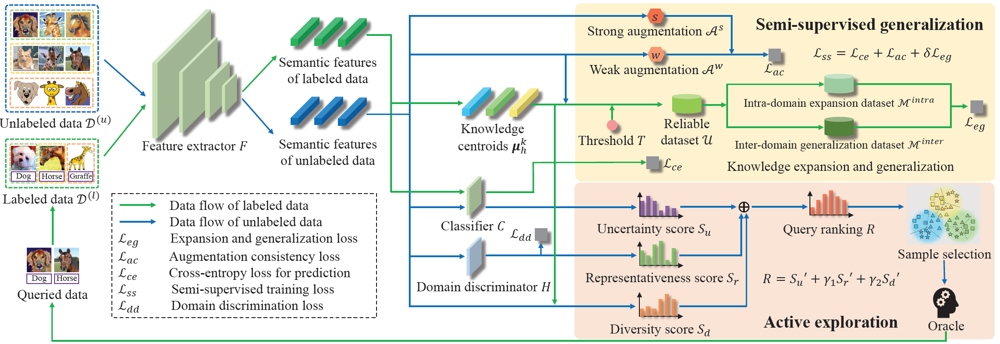

# CEG

## Contents
- [CEG](#ceg)
  - [Contents](#contents)
  - [Introduction](#introduction)
  - [Environment](#environment)
  - [Data Preparation](#data-preparation)
  - [Getting Started](#getting-started)
  - [Citing](#citing)
  - [Contact](#contact)

## Introduction
This repository contains the implementation code for paper:

**Label-Efficient Domain Generalization via Collaborative Exploration and Generalization**

Junkun Yuan, Xu Ma, Defang Chen, Kun Kuang, Fei Wu, Lanfen Lin

*International Conference on Multimedia (MM), 2022*

[[arXiv](https://arxiv.org/pdf/2208.03644)] [[Paper](https://dl.acm.org/doi/abs/10.1145/3503161.3548059)]

<p align="center">
     <br>
</p>

Domain generalization (DG) aims to learn a generalizable model from multiple well-annotated source domains to unknown target domains. However, it can be expensive to obtain sufficient annotation for source datasets. 

We introduce a novel task named label-efficient domain generalization (LEDG) to enable model generalization with label-limited source domains. To address this challenging task, we propose a novel framework called Collaborative Exploration and Generalization (CEG) which jointly optimizes active exploration and semi-supervised generalization. 

Specifically, in active exploration, to explore class and domain discriminability while avoiding information divergence and redundancy, we query the labels of the samples with the highest overall ranking of class uncertainty, domain representativeness, and information diversity. In semi-supervised generalization, we design MixUp-based intra- and inter-domain knowledge augmentation to expand domain knowledge and generalize domain invariance. We unify active exploration and semi-supervised generalization in a collaborative way and promote mutual enhancement between them, boosting model generalization with limited annotation. 

## Environment
Please build suitable Python environment by installing the following packages (Anaconda is recommended).
* python 3.7
* pytorch 1.7
* torchvision 0.8

Our code is based on a modified [DASSL](https://github.com/KaiyangZhou/Dassl.pytorch) library, please install it via:
```bash
cd Dassl.pytorch-CEG
python -m pip install -r requirements.txt
python setup.py develop
```

Device:
* GPU with RAM > 10 GB
* System memory > 8 GB

## Data Preparation
We list the adopted datasets below.

| Datasets | Download link|
| :-: | :- |
| PACS | https://dali-dl.github.io/project_iccv2017.html |
| Office-Home | https://www.hemanthdv.org/officeHomeDataset.html | |

- Please copy data to the path `datasets/data-pacs/` and `datasets/data-officehome/`.
- You may need to get permission to use the data under the datasets' license. 

## Getting Started
Configure `scripts/ADG/run_pacs.sh` and `scripts/ADG/run_home.sh` by setting source and target domains.

Run
```bash
sh scripts/run_pacs.sh
sh scripts/run_home.sh
```

Note:
- We find the results fluctuate with the environment. So it could be better to run several times and get the average results.
- Due to the fluctuation of the training process, we report the best results in the training history, which is relatively stable.

## Citing
If you find our code or idea useful for your research, please cite our work.
```bib
@inproceedings{yuan2022label,
  title={Label-Efficient Domain Generalization via Collaborative Exploration and Generalization},
  author={Yuan, Junkun and Ma, Xu and Chen, Defang and Kuang, Kun and Wu, Fei and Lin, Lanfen},
  booktitle={Proceedings of the 30th ACM International Conference on Multimedia},
  pages={2361--2370},
  year={2022}
}
```

## Contact
If you have any questions, feel free to contact us through email (yuanjk@zju.edu.cn or maxu@zju.edu.cn) or GitHub issues. Thanks!